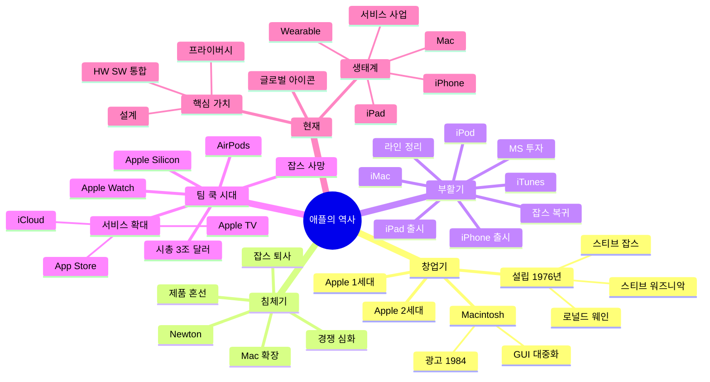

```mermaid
mindmap
  root((애플의 역사))
    창업기
      설립 1976년
        스티브 잡스
        스티브 워즈니악
        로널드 웨인
      Apple 1세대
      Apple 2세대
      Macintosh
        GUI 대중화
        광고 1984
    침체기
      잡스 퇴사
      Mac 확장
      Newton
      경쟁 심화
      제품 혼선
    부활기
      잡스 복귀
      MS 투자
      라인 정리
      iMac
      iPod
      iTunes
      iPhone 출시
      iPad 출시
    팀 쿡 시대
      잡스 사망
      Apple Watch
      AirPods
      Apple Silicon
      서비스 확대
        App Store
        iCloud
        Apple TV
      시총 3조 달러
    현재
      생태계
        iPhone
        Mac
        iPad
        Wearable
        서비스 사업
      핵심 가치
        설계
        프라이버시
        HW SW 통합
      글로벌 아이콘
```
