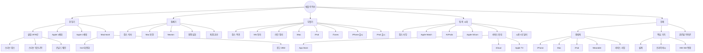

```mermaid
flowchart TD
  R((애플의 역사))

  R --> cy[창업기]
  cy --> cy1[설립 1976년]
  cy1 --> cy1a[스티브 잡스]
  cy1 --> cy1b[스티브 워즈니악]
  cy1 --> cy1c[로널드 웨인]
  cy --> cy2[Apple 1세대]
  cy --> cy3[Apple 2세대]
  cy --> cy4[Macintosh]
  cy4 --> cy4a[GUI 대중화]
  cy4 --> cy4b[광고 1984]

  R --> ch[침체기]
  ch --> ch1[잡스 퇴사]
  ch --> ch2[Mac 확장]
  ch --> ch3[Newton]
  ch --> ch4[경쟁 심화]
  ch --> ch5[제품 혼선]

  R --> bu[부활기]
  bu --> bu1[잡스 복귀]
  bu --> bu2[MS 투자]
  bu --> bu3[라인 정리]
  bu --> bu4[iMac]
  bu --> bu5[iPod]
  bu --> bu6[iTunes]
  bu --> bu7[iPhone 출시]
  bu --> bu8[iPad 출시]

  R --> tc[팀 쿡 시대]
  tc --> tc1[잡스 사망]
  tc --> tc2[Apple Watch]
  tc --> tc3[AirPods]
  tc --> tc4[Apple Silicon]
  tc --> tc5[서비스 확대]
  tc5 --> tc5a[App Store]
  tc5 --> tc5b[iCloud]
  tc5 --> tc5c[Apple TV]
  tc --> tc6[시총 3조 달러]

  R --> now[현재]
  now --> now1[생태계]
  now1 --> now1a[iPhone]
  now1 --> now1b[Mac]
  now1 --> now1c[iPad]
  now1 --> now1d[Wearable]
  now1 --> now1e[서비스 사업]
  now --> now2[핵심 가치]
  now2 --> now2a[설계]
  now2 --> now2b[프라이버시]
  now2 --> now2c[HW SW 통합]
  now --> now3[글로벌 아이콘]
```
